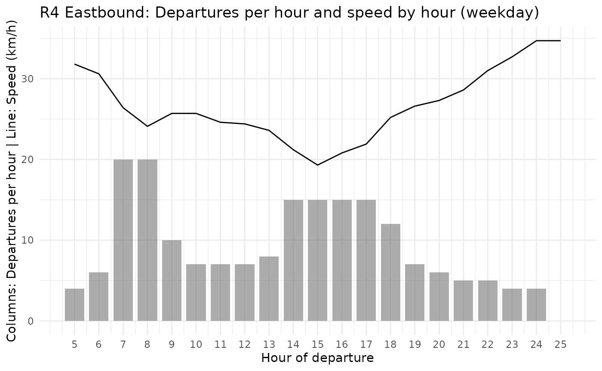
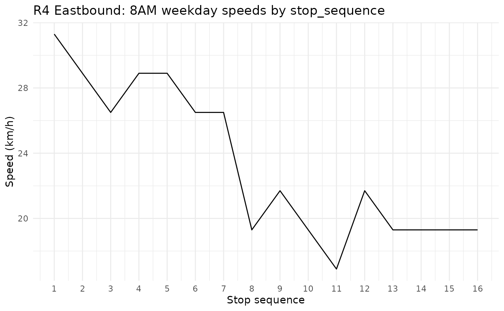

# SSFS data structure

``` r

library(dplyr)
#> 
#> Attaching package: 'dplyr'
#> The following objects are masked from 'package:stats':
#> 
#>     filter, lag
#> The following objects are masked from 'package:base':
#> 
#>     intersect, setdiff, setequal, union
library(ggplot2)
library(croquis)
```

The Simplified Speed and Frequency Specification (SSFS) is the
foundational data structure of Croquis. It consists of a simplified
representation of a GTFS (General Transit Feed Specification) and
contains the instructions for how to build one, which are read by
[`ssfs_to_gtfs()`](https://croquis.comotive.net/reference/ssfs_to_gtfs.md).

Like the GTFS, it contains a list of tables pertaining to a transit
network and schedule. In fact, three of the tables are shared (agency,
routes, and calendar) and are simply passed on from one data structure
to the other. The stops table is also carried over with a geometry
transformation. Unlike GTFS, SSFS does not contain stop_times or trips.
Instead, it contains:

- A simple features (geospatial) table called **itin** which contains
  the geometry of the distinct itineraries (or variants) of the routes.
- A data.frame table called **span** which contains the first and last
  departure time for each service window, for each service, and for each
  route itinerary.
- A data.frame called **hsh** which details the headway (interval
  between trips) and speed (in km/h) by hour of operation for each route
  itinerary and service.
- A data.frame called **stop_seq** which details the stop order for each
  route itinerary as well as the speed factor to apply to adjust speeds
  by route segment relative to the speed provided by hour in *hsh*. This
  is used to produce stop_times in conjunction with the distance between
  stops based on the geometry in *itin*.

SSFS was designed to facilitate production, editing and calibration of
transit networks and schedules in a GTFS-compatible format.

When you load a GTFS network into the Croquis Shiny app, it converts the
GTFS to an SSFS. Note that many details of the GTFS are dropped in this
conversion, in favour of a simpler data structure that facilitates rapid
modification while retaining key details including how service levels
and speeds vary throughout the day, and how speed varies across route
segments.

To convert a GTFS to an SSFS in the console, use
[`gtfs_to_ssfs()`](https://croquis.comotive.net/reference/gtfs_to_ssfs.md).
To produce an empty SSFS in the console, use
[`ssfs()`](https://croquis.comotive.net/reference/ssfs.md).

The rest of this vignette covers each table of the SSFS, including the
fields of each and data types. We will use `translink` data from
Vancouver that is included in the croquis package.

## SSFS tables

### agency

The **agency** table consists of the required and conditionally required
fields of the GTFS agency table. These are all `<chr>` fields. This
table is passed on between GTFS and SSFS formats.

The `agency_id` field links this table to the *routes* table.

``` r

head(translink$agency)
#>   agency_id agency_name               agency_url   agency_timezone
#> 1        TL   TransLink https://www.translink.ca America/Vancouver
```

### routes

The **routes** table consists of the required and conditionally required
fields of the GTFS routes table, plus `route_color` and
`route_text_color`. This table is passed on between GTFS and SSFS
formats. If an imported GTFS is missing the colour-related fields or
either of the conditionally required fields,
[`gtfs_to_ssfs()`](https://croquis.comotive.net/reference/gtfs_to_ssfs.md)
will produce them.

Field connections:

- The `agency_id` field connects this table to the *agency* table.
- The `route_id` field connects this table to the *itin* table.

``` r

glimpse(translink$routes)
#> Rows: 241
#> Columns: 7
#> $ route_id         <chr> "10232", "11201", "11202", "11692", "11693", "11696",…
#> $ agency_id        <chr> "TL", "TL", "TL", "TL", "TL", "TL", "TL", "TL", "TL",…
#> $ route_short_name <chr> "256", "033", "042", "364", "388", "609", "595", "414…
#> $ route_long_name  <chr> "Whitby Estate/Park Royal/Spuraway", "16 & 33rd Avenu…
#> $ route_type       <int> 3, 3, 3, 3, 3, 3, 3, 3, 1, 3, 3, 3, 3, 3, 3, 3, 3, 3,…
#> $ route_color      <chr> "92C5DE", "92C5DE", "92C5DE", "92C5DE", "92C5DE", "92…
#> $ route_text_color <chr> "000000", "000000", "000000", "000000", "000000", "00…
```

### stops

**stops** in the SSFS is a simple features table that consists of the
stop_id and stop_name fields that are passed on between the SSFS and
GTFS, plus a `POINT` geometry field based on the stop_lat and stop_lon
of the GTFS.

The `stop_id` field connects this table to the *stop_seq* table.

``` r

glimpse(translink$stops)
#> Rows: 8,669
#> Columns: 3
#> $ stop_id   <chr> "1", "10000", "10001", "10002", "10003", "10004", "10005", "…
#> $ stop_name <chr> "Westbound Davie St @ Bidwell St", "Northbound No. 5 Rd @ Mc…
#> $ geometry  <POINT [°]> POINT (-123.1407 49.28659), POINT (-123.0915 49.17996)…
```

### itin

**itin** is a simple features table that identifies each unique route
itinerary in the network and provides a `LINESTRING` geometry for each.
Each itinerary corresponds to a unique trip pattern (combination of
stop_id and stop_sequence) of a route. The geometry is based on data
from `shapes` table of the GTFS. In the case of GTFS that does not
include a `shapes` table,
[`gtfs_to_ssfs()`](https://croquis.comotive.net/reference/gtfs_to_ssfs.md)
will create one by either connecting the stops directly or by connecting
the stops along the road network using the `osrm` or `valh` packages,
depending on associated route_type and the availability of OSRM or
Valhalla routing servers.

*itin* also includes the `direction_id` and `trip_headsign` fields which
are carried over from the GTFS trips table and are used to create trips
data when producing a GTFS from the SSFS with
[`ssfs_to_gtfs()`](https://croquis.comotive.net/reference/ssfs_to_gtfs.md).

Field connections:

- The `itin_id` field connects this table to the *stop_seq*, *span*, and
  *hsh* tables.
- The `route_id` field connects this table to the *routes* table.

``` r

glimpse(translink$itin)
#> Rows: 904
#> Columns: 5
#> Groups: itin_id [904]
#> $ itin_id       <chr> "10232_0_1", "10232_1_1", "11201_0_1", "11201_1_1", "116…
#> $ route_id      <chr> "10232", "10232", "11201", "11201", "11692", "11692", "1…
#> $ direction_id  <int> 0, 1, 0, 1, 0, 1, 0, 1, 0, 1, 0, 0, 1, 1, 0, 1, 1, 0, 0,…
#> $ trip_headsign <chr> "256 21st To Whitby Estates", "256 Park Royal", "33 16th…
#> $ geometry      <LINESTRING [°]> LINESTRING (-123.1393 49.32..., LINESTRING (-…
```

### calendar

The **calendar** table is carried over directly from the GTFS calendar
table and consists of all of its required fields. It defines the
operating dates of each service.

The `service_id` field connects to the *span* and *hsh* tables.

``` r

head(translink$calendar)
#>   service_id monday tuesday wednesday thursday friday saturday sunday
#> 1    mon-fri      1       1         1        1      1        0      0
#> 2        sat      0       0         0        0      0        1      0
#> 3        sun      0       0         0        0      0        0      1
#>   start_date   end_date
#> 1 2026-04-20 2026-06-07
#> 2 2026-04-20 2026-06-07
#> 3 2026-04-20 2026-06-07
```

### span

The **span** table contains data on the first and last departure time
for each service window, for each service, and for each route itinerary.
A service window is a period during which continuous service is offered
based on headways defined in the *hsh* table.

Field connections:

- The `itin_id` field connects to the *itin*, *hsh*, and *stop_seq*
  tables.
- The `service_id` field connects to *calendar* and *hsh*.

``` r

glimpse(translink$span)
#> Rows: 2,410
#> Columns: 5
#> $ itin_id        <chr> "10232_0_1", "10232_0_1", "10232_0_1", "10232_1_1", "10…
#> $ service_id     <chr> "mon-fri", "sat", "sun", "mon-fri", "sat", "sun", "mon-…
#> $ service_window <int> 1, 1, 1, 1, 1, 1, 1, 1, 1, 1, 1, 1, 1, 1, 1, 1, 1, 1, 1…
#> $ first_dep      <chr> "06:05:00", "07:05:00", "09:05:00", "06:40:00", "07:40:…
#> $ last_dep       <chr> "19:05:00", "21:05:00", "20:05:00", "19:40:00", "21:40:…
```

### hsh

The **hsh** table details the headway (interval between trips) and speed
(in km/h) by hour of operation for each route itinerary and service.

When importing a GTFS into Croquis or converting a GTFS to SSFS,
[`gtfs_to_ssfs()`](https://croquis.comotive.net/reference/gtfs_to_ssfs.md)
calculates the average commercial speed of trips by route itinerary,
service, and hour. This data is stored in the hsh table, to be viewed
and edited while in SSFS format, then converted into stop_times based on
the hour-by-hour data.

``` r

glimpse(translink$hsh)
#> Rows: 23,529
#> Columns: 5
#> $ itin_id    <chr> "10232_0_1", "10232_0_1", "10232_0_1", "10232_0_1", "10232_…
#> $ service_id <chr> "mon-fri", "mon-fri", "mon-fri", "mon-fri", "mon-fri", "mon…
#> $ hour_dep   <chr> "06:00:00", "07:00:00", "08:00:00", "09:00:00", "10:00:00",…
#> $ headway    <int> 60, 60, 60, 60, 60, 60, 60, 60, 60, 60, 60, 60, 60, NA, 60,…
#> $ speed      <dbl> 20, 20, 20, 20, 20, 20, 20, 20, 20, 20, 20, 20, 20, 20, 20,…
```

As mentioned, the SSFS allows us to view and modify how speeds and
service levels vary throughout the day. Converting a GTFS to SSFS can be
useful for gathering summary information about service levels and
speeds. Below is an example for generating a visual for daily service
level and speed variation for weekday service on the R4 eastbound in
Vancouver.

``` r

# Fetch route ID for R4
r4_route_id <- 
  translink$routes |> 
  filter(route_short_name == "R4") |> 
  pull(route_id)

# Fetch itin ID for R4 bound for Joyce-Collingwood Station
r4_e_itin_id <- 
  translink$itin |> 
  filter(route_id == r4_route_id, stringr::str_detect(trip_headsign,"Joyce")) |> 
  pull(itin_id)

# Fetch headway and speeds by hour table for weekday service and R4 bound for Joyce-Collingwood
r4_trips_ph_speed <- 
translink$hsh |> 
  filter(itin_id == r4_e_itin_id, service_id == "mon-fri") |> 
  mutate(
    trips_per_hour=floor(60/headway),
    hour_dep = as.numeric(stringr::str_sub(hour_dep,1,2))) |> 
  select(hour_dep,trips_per_hour,speed)

# Visualise trips per hour and speeds in a ggplot
ggplot(r4_trips_ph_speed,aes(x = hour_dep))+
  geom_col(aes(y = trips_per_hour), width = 0.8, alpha = 0.5)+
  geom_line(aes(y = speed)) +
  scale_y_continuous(
    name = "Columns: Departures per hour | Line: Speed (km/h)")+
  scale_x_continuous(breaks = r4_trips_ph_speed$hour_dep)+
  labs(
    title = "R4 Eastbound: Departures per hour and speed by hour (weekday)",
    x = "Hour of departure") +
  theme_minimal()
#> Warning: Removed 1 row containing missing values or values outside the scale range
#> (`geom_col()`).
```



### stop_seq

The **stop_seq** table details the stop order for each route itinerary
as well as the speed factor to apply to adjust speeds by route segment.
When converting a GTFS to SSFS, speed_factors are calculated once per
itinerary and per stop based on how the average interstop speed between
that stop and the next one compares to the average speed of all trips of
that itinerary. Speed factors are therefore not provided for the last
stop in any stop sequence.

``` r

glimpse(translink$stop_seq)
#> Rows: 27,309
#> Columns: 4
#> $ itin_id       <chr> "10232_0_1", "10232_0_1", "10232_0_1", "10232_0_1", "102…
#> $ stop_id       <chr> "10947", "4782", "12883", "11118", "4491", "4661", "4662…
#> $ stop_sequence <int> 1, 2, 3, 4, 5, 6, 7, 8, 9, 10, 11, 12, 13, 14, 15, 16, 1…
#> $ speed_factor  <dbl> 0.9, 1.2, 1.0, 0.7, 1.2, 0.4, 0.9, 1.0, 1.0, 1.1, 0.9, 1…
```

The singular speed factor per stop is a heuristic approach that does not
take into account how the relative speed of segments could vary
throughout the day or depending on the service (weekday vs. weekend).

To demonstrate how the speed_factor field adjusts the speeds of a model
to better represent the behaviour of a transit vehicle on a given route,
below is a graph of the modelled speeds on the R4 route eastbound from
UBC to Joyce-Collingwood for departures between 8:00AM and 8:59AM.
Reflecting the data in the GTFS, speeds at the beginning of the route
(on W 41st Avenue west of Granville Street and through the UBC Endowment
Lands) are higher than further east along the route, where the route
passes through denser and more congested segments of W 41st Avenue.

``` r

# Avg speed R4 EB 8AM
avg_speed_8am <- 
  r4_trips_ph_speed |> filter(hour_dep == 8) |> pull(speed)

stop_seq_speeds_8am <- 
translink$stop_seq |> 
  filter(itin_id == r4_e_itin_id) |> 
  left_join(translink$stops |> as.data.frame() |> select(stop_id,stop_name),
  by= "stop_id") |> 
    mutate(speed = round(avg_speed_8am*speed_factor,1)) |> 
    select(stop_sequence,stop_name,speed)

print(stop_seq_speeds_8am)
#>    stop_sequence                              stop_name speed
#> 1              1                   UBC Exchange @ Bay 4  31.3
#> 2              2 Southbound Wesbrook Mall @ Agronomy Rd  28.9
#> 3              3     Westbound W 16 Ave @ Wesbrook Mall  26.5
#> 4              4                    Dunbar Loop @ Bay 7  28.9
#> 5              5      Eastbound W 41 Ave @ Carnarvon St  28.9
#> 6              6          Eastbound W 41 Ave @ Maple St  26.5
#> 7              7      Eastbound W 41 Ave @ Granville St  26.5
#> 8              8            Eastbound W 41 Ave @ Oak St  19.3
#> 9              9      Oakridge-41st Ave Station @ Bay 3  21.7
#> 10            10           Eastbound E 41 Ave @ Main St  19.3
#> 11            11         Eastbound E 41 Ave @ Fraser St  16.9
#> 12            12         Eastbound E 41 Ave @ Knight St  21.7
#> 13            13       Eastbound E 41 Ave @ Victoria Dr  19.3
#> 14            14      Eastbound E 41 Ave @ Clarendon St  19.3
#> 15            15         Eastbound E 41 Ave @ Rupert St  19.3
#> 16            16         Northbound Joyce St @ Kingsway  19.3
#> 17            17      Joyce Station @ Bay 1 Unload Only    NA

# Visualise trips per hour and speeds in a ggplot
ggplot(stop_seq_speeds_8am[1:(nrow(stop_seq_speeds_8am)-1),],aes(x = stop_sequence))+
  geom_line(aes(y = speed)) +
  scale_y_continuous(
    name = "Speed (km/h)")+
  scale_x_continuous(breaks = stop_seq_speeds_8am$stop_sequence)+
  labs(
    title = "R4 Eastbound: 8AM weekday speeds by stop_sequence",
    x = "Stop sequence") +
  theme_minimal()
```



Together, these 8 tables provide a compact and easily-editable
representation of a transit network that readily converts to a GTFS.
SSFS objects in croquis have a formal class “ssfs” which is assigned
when creating a new SSFS using the
[`ssfs()`](https://croquis.comotive.net/reference/ssfs.md) construtor
function. The
[`validate_ssfs()`](https://croquis.comotive.net/reference/validate_ssfs.md)
function is a useful companion when building SSFS data in programmed
workflows and in the console.
