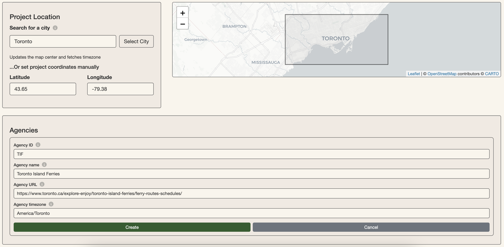
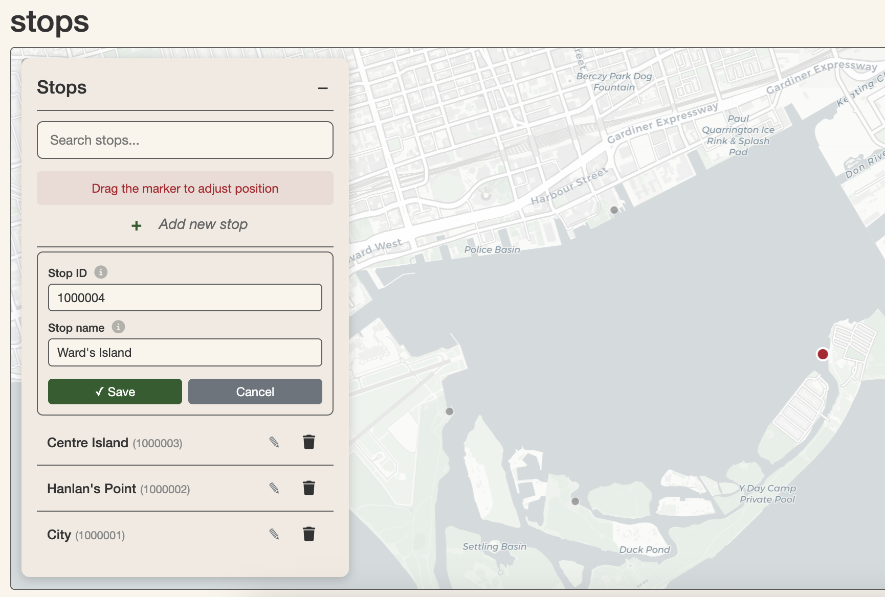
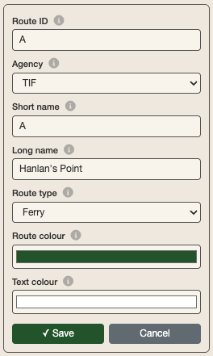
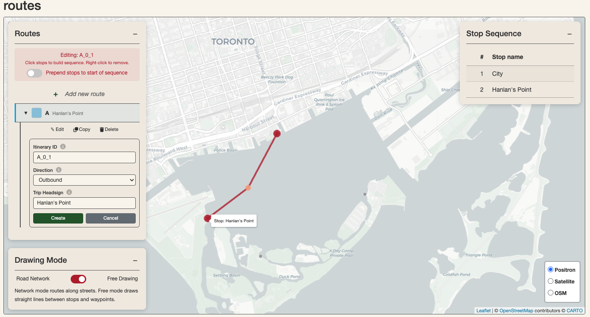
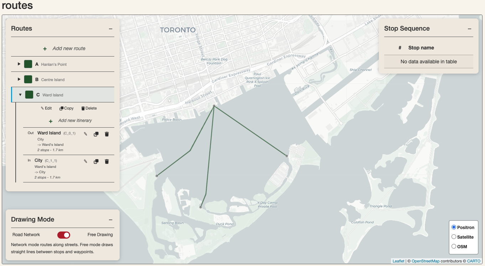
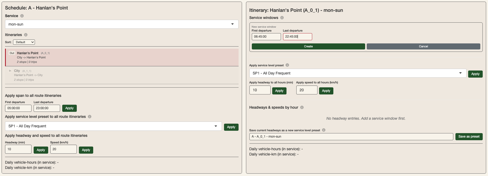
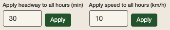
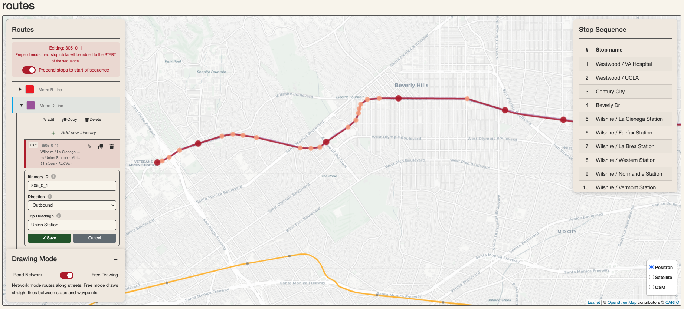

```{r, include = FALSE}
knitr::opts_chunk$set(
  collapse = TRUE,
  comment = "#>"
)
```

```{r setup}
library(croquis)
```

**croquis** can be used to produce GTFS (General Transit Feed Specification) for planning and research purposes within minutes. This is possible thanks to the Simplified Speed and Frequency Specification (SSFS) data structure that this package introduces.

This vignette is a walkthrough for producing a GTFS with the Croquis Shiny app. It introduces the basic functionalities of the app as well as how they work. It covers how to produce a GTFS from scratch or by uploading an existing one, either using the `croquis()` Shiny App or by using in-package functions including `gtfs_to_ssfs()`,`ssfs()` and `ssfs_to_gtfs()`. 

## Producing a GTFS from scratch

To launch the Croquis Shiny app, run:

```r
croquis()
```

**You can produce a GTFS entirely using the Shiny app and without any code other than the line above**. For the sake of demonstrating how the app builds transit networks and schedules in the back-end, this vignette also demonstrates how to use the base functions in croquis to build a simple GTFS in your R console without the Shiny App. The Shiny app is, in essence, a wrapper of these base functions. 

For this demonstration, we will build a toy GTFS for Toronto Island Ferries based on its summer 2026 schedule.

### Getting started: setting agency details

On the Home page of the Shiny App, set the project location by searching for a city or setting the coordinates manually. For the Toronto Island Ferries, you can search for "Toronto" in the `Search for a city` input and click `Select city`. This will center the map on the desired region in the other modules to make network modification easier. Provide agency details by clicking `+ Add new agency` in the Agencies panel. Fill out these details and click "Create". This information will all be passed on directly to the final GTFS.

```{r, echo=FALSE, out.width="100%", fig.cap="Create agency details in the Croquis Shiny app."}

```

Using the croquis base functions, you can initialize your transit network model by creating a skeleton SSFS and modifying the agency table directly:

```{r, message = FALSE}
ssfs_tif <- ssfs()

# add agency details
ssfs_tif$agency <- data.frame(
  agency_id = "TIF",
  agency_name = "Toronto Island Ferries",
  agency_url = "https://www.toronto.ca/explore-enjoy/toronto-island-ferries/ferry-routes-schedules/",
  agency_timezone = "America/Toronto"
)
```

### Creating stops

The Toronto Island Ferries network consists of four stops: City (Jack Layton Ferry Terminal), Centre Island, Hanlan's Point and Ward's Island. In the app, go to the Stops module to create them by clicking `+ Add new stop` in the left hand panel, then clicking on the desired location and providing a stop name for each. The app automatically generates stop ids, which you can overwrite if you wish to provide your own.

```{r, echo=FALSE, out.width="60%", fig.cap="Create stops in the Shiny app."}

```

Manually, you could also add these stops to the SSFS as an sf in the R console:

```{r, message = FALSE}
# add stops
ssfs_tif$stops <- sf::st_sf(
  stop_id = c("CT", "CI", "HP", "WI"),
  stop_name = c(
    "City",
    "Centre Island",
    "Hanlan's Point",
    "Ward's Island"
  ),
  geometry = sf::st_sfc(
    sf::st_point(c(-79.37517, 43.6402)),
    sf::st_point(c(-79.37844, 43.62245)),
    sf::st_point(c(-79.38905, 43.62791)),
    sf::st_point(c(-79.35771, 43.63139)),
    crs = 4326
  )
)
```

### Creating routes and itineraries

The Toronto Island Ferries network consists of 3 routes: one connecting the city with each of the three other stops. Each one of these routes consists of two **itineraries** (these could otherwise be referred to as variants or patterns): an outbound itinerary to the islands, and an inbound itinerary to the city.

In the Shiny app Routes module, create the 3 routes by clicking `+ Add new route` in the left-hand panel and providing details for each, including route type and colour. 

```{r, echo=FALSE, out.width="30%", fig.cap="Producing route details for the Hanlan's Point route."}

```

Once any of your routes are created, you can then create route itineraries on the map by clicking on `+ Add new itinerary`, which appears under every route in the left-hand menu when expanded. In editing mode, click on the first stop of your itinerary to start. Then, click on the next stop of your route itinerary. This adds it to the stop sequence. You can continue to click on stops to add them to the stop sequence of your itinerary until the desired terminus. You can also create waypoints by clicking elsewhere on the map other than stops. You may also switch between `Road Network` and `Free Drawing` Drawing modes while creating your route itinerary, which determines how stops and waypoints are connected: either along the road network using `OSRM` or by connecting nodes directly. To delete a stop or waypoint from a route itinerary, right-click on it. Hitting `backspace` on your keyboard will delete the last stop in the stop sequence.

In our Toronto Island Ferries example, each route itinerary only consists of two stops. Since we selected `Ferry` as the route type in creating our routes, `Free Drawing` is automatically selected.

Before finishing your route itinerary, ensure that you have assigned it a `Trip Headsign`.

```{r, echo=FALSE, out.width="100%", fig.cap="Creating the outbound itinerary for the Hanlan's point route. A waypoint is in between the City stop and the Hanlan's Point stop to add detail to the path."}

```

The Toronto Island Ferries model should consist of 6 itineraries total: 2 for each of the 3 routes. Your network should appear as follows in the Routes module when finished with this section:

```{r, echo=FALSE, out.width="100%", fig.cap="Routes module after producing all the Route and Itinerary details for the Toronto Island Ferries network."}

```

The Routes module of the Shiny app simultaneously manages 3 of the SSFS tables: routes, itin, and stop_seq. Below is a demonstration of how we could accomplish the same thing we did in the Shiny app in the console by modifying the SSFS:

```{r, message = FALSE}
# Routes table (this info is passed onto the final GTFS)
ssfs_tif$routes <- data.frame(
  route_id = c("A", "B", "C"),
  agency_id = c("TIF", "TIF", "TIF"),
  route_short_name = c("A", "B", "C"),
  route_long_name = c("Hanlan's Point", "Centre Island", "Ward Island"),
  route_type = c(4L, 4L, 4L),
  route_color = c("2B5D2C", "2B5D2C", "2B5D2C"),
  route_text_color = c("FFFFFF", "FFFFFF", "FFFFFF")
)

# create itin table
city    <- sf::st_coordinates(ssfs_tif$stops[ssfs_tif$stops$stop_id == "CT", ])
hanlans <- sf::st_coordinates(ssfs_tif$stops[ssfs_tif$stops$stop_id == "HP", ])
centre  <- sf::st_coordinates(ssfs_tif$stops[ssfs_tif$stops$stop_id == "CI", ])
wards   <- sf::st_coordinates(ssfs_tif$stops[ssfs_tif$stops$stop_id == "WI", ])

ssfs_tif$itin <- sf::st_sf(
  itin_id      = c("A_0_1", "A_1_1", "B_0_1", "B_1_1", "C_0_1", "C_1_1"),
  route_id     = c("A",     "A",     "B",     "B",     "C",     "C"),
  direction_id = c(0L,       1L,      0L,      1L,      0L,      1L),
  trip_headsign = c(
    "Hanlan's Point", "City",
    "Centre Island",  "City",
    "Ward's Island",  "City"
  ),
  geometry = sf::st_sfc(
    sf::st_linestring(rbind(city, hanlans)),
    sf::st_linestring(rbind(hanlans, city)),
    sf::st_linestring(rbind(city, centre)),
    sf::st_linestring(rbind(centre, city)),
    sf::st_linestring(rbind(city, wards)),
    sf::st_linestring(rbind(wards, city)),
    crs = 4326
  )
)

# Make stop_seq table
ssfs_tif$stop_seq <- data.frame(
  itin_id = c(
    "A_0_1", "A_0_1", "A_1_1", "A_1_1",
    "B_0_1", "B_0_1", "B_1_1", "B_1_1",
    "C_0_1", "C_0_1", "C_1_1", "C_1_1"
  ),
  stop_id = c(
    "CT", "HP", "HP", "CT",
    "CT", "CI", "CI", "CT",
    "CT", "WI", "WI", "CT"
  ),
  stop_sequence = rep(c(1L, 2L), 6),
  speed_factor = rep(1.0, 12)
)
```

### Creating the schedule

In the Schedule module of the Shiny app, you can specify schedule details for each route and itinerary. 

The Toronto Island Ferries offers the same service Monday through Sunday throughout the summer. Each route and route itinerary has distinct headways (intervals between trips) as well as spans (time of first and last departure).

After selecting a route in the map panel, a route-level schedule and service cost overview appears in the schedule editing panel below on the left. The Shiny App automatically generates a Monday-Sunday service and selects it. You can manage the calendar table, including start and end dates, by clicking `Configure service calendar` in the bottom-left corner of the Schedule module. For our Toronto Island Ferries example, the automatically-generated service serves us perfectly.

By selecting one of the itineraries, its details load on the right-side panel. Start by defining a service window by clicking `+ Add new service window`. For the Hanlan's Point outbound itinerary departing from the city to Hanlan's point, the first trip is at 6:45 and the last one is at 22:45.

```{r, echo=FALSE, out.width="100%", fig.cap="Creating a service window for the outbound itinerary of the Hanlan's point route."}

```

Creating a service window initializes the headway and speeds by hour table below. You can batch apply headways and speeds by using the buttons above it. The Hanlan's Point route essentially runs a 30-minute headway service all-day in both directions, so we can apply this headway to all hours. The 2km journey in either direction takes about 10-15 minutes, so we can apply a 10 km/h speed to all hours.

```{r, echo=FALSE, out.width="40%", fig.cap="Batch apply headways and speeds to a selected itinerary and service when an itinerary has been created."}

```

Repeat this process for the inbound itinerary of this route as well as for the itineraries of the other two routes.

The Schedule module simultaneously manages the `span`,`hsh`, and `calendar` tables of the SSFS. Below is a demonstration of how we would achieve the same result by building the SSFS in the console instead of in the Shiny app:

```{r, message = FALSE}
# Make calendar table
ssfs_tif$calendar <- data.frame(
  service_id = "mon-sun", 
  monday = 1, tuesday = 1, wednesday = 1, thursday = 1, friday = 1, saturday = 1, sunday = 1,
  start_date = "2026-05-13",
  end_date = "2026-09-15"
)

# Make spans table
ssfs_tif$span <- data.frame(
  itin_id = c(
    "A_0_1", "A_1_1","B_0_1", "B_1_1", "C_0_1", "C_1_1"
  ),
  service_id = rep("mon-sun",6),
  service_window = rep(1, 6),
  first_dep = c("06:45:00","07:00:00","08:00:00","08:15:00","06:30:00","06:45:00"),
  last_dep = c("22:45:00","23:00:00","23:30:00","23:45:00","23:30:00","23:45:00")
)

# Make headways and speeds by hour table
ssfs_tif$hsh <- data.frame(
  itin_id = rep(
    c("A_0_1", "A_1_1", "B_0_1", "B_1_1", "C_0_1", "C_1_1"),
    times = c(17, 17, 16, 16, 18, 18)
  ),
  service_id = "mon-sun",
  hour_dep = sprintf("%02d:00:00", c(
    6:22, 7:23, 8:23, 8:23, 6:23, 6:23
  )),
  headway = 30L, # This simplifies trip departure intervals relative to reality. 
  # You can use a rep(c(headway,n),c(headway,n)...) pattern to be more precise
  speed = 10
)
```

### Exporting the GTFS

Once you have finished creating stops, routes and a schedule, you can export your croquis project to GTFS by clicking on the save (floppy disk) icon in the navigation bar of the Shiny App and clicking `Download GTFS`. You can optionally rename your exported GTFS file or choose to include shape_dist_traveled in your output GTFS before clicking `Download GTFS`.

Exporting a GTFS works by calling the `ssfs_to_gtfs()` function and using `gtfstools::write_gtfs()`. In workflows that don't involve the Shiny App, you can create a GTFS using this function as follows:

```r
# create the GTFS from the SSFS
gtfs_tif <- ssfs_to_gtfs(ssfs_tif)

# to export the GTFS from your R environment, you can use a function such as gtfstools::write_gtfs()
gtfstools::write_gtfs(gtfs_tif,"gtfs_tif.zip")
```

## Producing a GTFS based on an existing one

Using the Croquis Shiny app, you can upload any GTFS on the home page (in `Load Network`) in order to edit routes and schedules and export a new GTFS. Uploading a GTFS into the app will convert the GTFS to an SSFS, using `gtfs_to_ssfs()`. The SSFS retains many critical details of the original GTFS, including how service levels vary throughout the day and how speed varies across route segments and time of day. It is important to be aware that other details, for example specific stop times and non-mandatory GTFS tables including fares, will be lost in the conversion.

This section demonstrates how to modify an existing network and export a scenario GTFS in the Croquis Shiny app with an example based on the Metro D Line extension in Los Angeles, planned for 2027. You can download a 2026 version of the LA Metro rail GTFS from the [MobilityDatabase](https://files.mobilitydatabase.org/mdb-30/mdb-30-202608230057/mdb-30-202608230057.zip).

It also demonstrates how to modify an existing schedule GTFS using Croquis functions within the console.

### In the Croquis Shiny app

Run the app with `croquis()` and upload the LA metro GTFS in the `Load Network` panel of the Home module. There are 4 new stations of the Metro D Line in the planned extension: Beverly Dr, Century City, Westwood / UCLA and Westwood / VA Hospital. Our first step is to add them. Navigate to the Stops module. You will see that all the stations of the LA metro rail network are already loaded. Add the four new stations in the same way we would add stops if we were building the network from scratch (see the previous section).

The only other thing we need to do is extend the route itineraries for Metro Line D to Westwood / VA Hospital. For the variant that starts at Union Station and ends at Wilshire / La Cienaga, this is straightforward: in the Routes module, click on Metro Line D in the left-hand routes panel to expand and view the itineraries. Click on the pencil icon associated with the itinerary that starts at Union Station and ends at Wilshire / La Cienaga. This will activate editing mode for this itinerary. Click on the map to extend the itinerary with waypoints along Wilshire Boulevard toward Beverly Drive. Click on the Beverly Dr station to add it to the itinerary stop sequence. Continue in this way until you have extended the line to Westwood / VA Hospital, adding the other new stations to the stop sequence along the way. Click `Save` in the left-hand routes panel to confirm your edits.

For the itinerary that starts at Wilshire / La Cienaga and ends at Union Station, you will need to activate **prepend** mode in order to add stops to the beginning of the sequence instead of at the end. The prepend mode toggle appears once you activate editing mode with the pencil icon. Activate prepend mode and click on the stops towards Westwood / VA station to connect them first with straight lines. Then, you can click along the route to add waypoints. You can move them by clicking on them again once they have been created and clicking on the desired spot or dragging them there. 

```{r, echo=FALSE, out.width="100%", fig.cap="Extend both inbound and outbound itineraries to the new terminus at Westwood / VA Hospital. For the Eastbound itinerary, activate prepend stops mode to add stops to the start of sequence instead of at the end."}

```

For this example, modifying the schedule details is optional if we want to preserve the same level of service in the output GTFS. Click on the save icon and export the GTFS. The `ssfs_to_gtfs()` function that runs in the background will take care of generating new stop times that reflect the extension, taking into account the headways of the original GTFS, the average speeds by hour of the original GTFS, and the distance between the new stations along the newly-drawn extension.

### In the R console

Croquis includes several helper functions, like `gtfs_retain_routes()` and `ssfs_subset()`, that facilitate hybrid workflows with existing GTFS, scenario SSFS, and the Croquis Shiny app. Below is one example with the LA Metro E Line. The goal of this demonstration will be to create a scenario GTFS for this line where speeds are increased by 30% to 40 km/h (they are currently at 32 km/h most of the day) and service frequency is increased to a 5-minute headway at peak.

First, load the GTFS into the R environment using `gtfstools`:

``` r
#path to a 2026 version of the GTFS Schedule for LA Metro (rail) hosted on the MobilityDatabase
path_gtfs <- "https://files.mobilitydatabase.org/mdb-30/mdb-30-202608230057/mdb-30-202608230057.zip"

gtfs_lametro <- gtfstools::read_gtfs(path_gtfs)
```

It is useful to isolate the route that we want to edit from the rest of the GTFS before converting it to SSFS. This allows the rest of the GTFS to be conserved as-is. We can use `gtfs_retain_routes()` to isolate Metro E Line and `gtfs_remove_routes()` to create a reference GTFS for the rest of the lines.

```r
# First, identify the route id associated with Metro E Line
route_id_e_line <- 
  gtfs_lametro$routes$route_id[gtfs_lametro$routes$route_long_name == "Metro E Line"]

# Create a subset GTFS with only Metro E Line
gtfs_e_line_ref <- 
  gtfs_retain_routes(gtfs = gtfs_lametro,retain_routes = route_id_e_line)

# Create a reference GTFS for the rest of the network
gtfs_ref_no_e <- 
  gtfs_remove_routes(gtfs = gtfs_lametro,remove_routes = route_id_e_line)
``` 

Convert the subset GTFS for the E Line to an SSFS in order to then apply the operations to improve speeds and headways on weekdays and convert the modified SSFS to a GTFS. This GTFS can then be used as an input in various analyses that evaluate the costs and benefits of this change, including on travel times and accessibility which can be evaluated with [r5r](https://github.com/ipeaGIT/r5r).

```r
# Convert E Line GTFS to SSFS
ssfs_e_line <- gtfs_to_ssfs(gtfs = gtfs_e_line_ref)

# Increase speeds to 40 km/h
ssfs_e_line$hsh$speed <- 40

# Reduce headways to 5 minutes at peak on weekdays
mod_idx <- which(
  ssfs_e_line$hsh$service_id == "mon-fri" &
    ssfs_e_line$hsh$hour_dep %in% c("06:00:00","07:00:00","08:00:00","15:00:00","16:00:00","17:00:00"))

# apply 5 minute headway to affected rows in the hsh table
ssfs_e_line$hsh$headway[mod_idx] <- 5

# At any point, load the ssfs_e_line model into the Croquis Shiny App to make changes in the app if desired
# croquis(ssfs = ssfs_e_line)

# Convert modified E Line SSFS back to GTFS
gtfs_e_line_prop <- ssfs_to_gtfs(ssfs_e_line)

# Write new E Line GTFS and reference GTFS without the E line using {gtfstools}
gtfstools::write_gtfs(gtfs_e_line_prop,"gtfs_e_line_prop.zip")
gtfstools::write_gtfs(gtfs_ref_no_e,"gtfs_ref_no_e.zip")
```